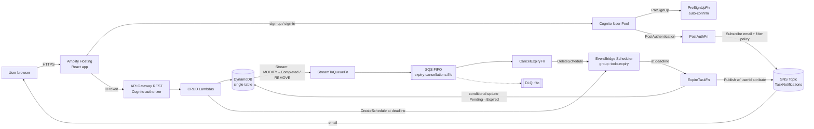

# Lab Plan — Serverless To-Do with Event-Driven Expiry (AWS SAM)

Defaults assumed (swap if you prefer): **Python 3.12 + Powertools** for Lambdas, **React + Vite + aws-amplify v6** for the frontend, **GitHub Actions** for the SAM pipeline, **two repos** (this one = backend/SAM, a second one = frontend).

---

## 1. Architecture at a glance



**Three flows to be able to explain in the review:**

1. **Create** → API → `CreateTaskFn` writes item (`Status=Pending`, `Deadline=now+5min`) and creates a one-time EventBridge Scheduler schedule `task-<taskId>` with `at(...)`, target = `ExpireTaskFn`, `ActionAfterCompletion: DELETE`.
2. **Expire** → Scheduler fires → `ExpireTaskFn` does a *conditional* update `Status = Expired IF Status = Pending` → on success publishes to SNS with message attribute `userId` → only that user's subscription matches its filter policy → email.
3. **Cancel** → user completes/deletes task → DynamoDB Stream record → `StreamToQueueFn` (event filter only passes Completed/REMOVE) → SQS FIFO (`MessageGroupId=taskId`, dedup id per event) → `CancelExpiryFn` calls `DeleteSchedule`; `ResourceNotFound` = already gone = success (idempotent).

Defence in depth: even if cancellation loses a race with the schedule, the conditional update in `ExpireTaskFn` fails for a Completed/deleted task, so no wrong email is sent. Good talking point.

---

## 2. DynamoDB single-table design

Table `TodoTable` — `PAY_PER_REQUEST`, Streams `NEW_AND_OLD_IMAGES`, PITR on.

| Entity | PK | SK | GSI1PK | GSI1SK |
|---|---|---|---|---|
| Task | `USER#<sub>` | `TASK#<taskId>` | `USER#<sub>` | `STATUS#<Status>#<DeadlineISO>` |
| User profile | `USER#<sub>` | `PROFILE` | – | – |

Task attributes: `EntityType=TASK`, `TaskId` (uuid4), `UserId` (Cognito `sub`), `Email`, `Description`, `Date` (user's due date, YYYY-MM-DD), `Status` (`Pending|Completed|Expired`), `Deadline` (epoch seconds), `DeadlineISO`, `ScheduleName`, `CreatedAt`, `UpdatedAt`, `CompletedAt` / `ExpiredAt`.

Profile attributes: `Email`, `SubscriptionArn`, `SubscribedAt` (written by PostAuthFn).

| Access pattern | Operation |
|---|---|
| List my tasks | Query PK=`USER#sub`, SK begins_with `TASK#` |
| List my tasks by status | Query GSI1 PK=`USER#sub`, GSI1SK begins_with `STATUS#Pending` |
| Get / update / delete one task | GetItem/UpdateItem/DeleteItem on PK+SK (ownership enforced by the key itself) |
| User subscription record | GetItem PK=`USER#sub`, SK=`PROFILE` |

Rules: `UserId` always comes from `event.requestContext.authorizer.claims.sub`, never the body. Keep `GSI1SK` in sync whenever `Status` changes. `Status` and `Date` are reserved words → use `ExpressionAttributeNames`.

---

## 3. SAM template inventory (`template.yaml`)

**Globals:** `python3.12`, `arm64`, `Tracing: Active`, `LoggingConfig.LogFormat: JSON`, env `TABLE_NAME`, `POWERTOOLS_SERVICE_NAME`, `LOG_LEVEL`.

**Parameters:** `Stage`, `FrontendRepoUrl`, `FrontendBranch` (main), `GitHubTokenSecretName`.

| Resource | Type | Key settings |
|---|---|---|
| `TodoTable` | `AWS::DynamoDB::Table` | as section 2 |
| `TaskNotificationsTopic` | `AWS::SNS::Topic` | |
| `UserPool` | `AWS::Cognito::UserPool` | `UsernameAttributes: [email]`, `AutoVerifiedAttributes: [email]`, password policy |
| `UserPoolClient` | `AWS::Cognito::UserPoolClient` | no secret; `ALLOW_USER_SRP_AUTH`, `ALLOW_USER_PASSWORD_AUTH` (for CLI tests), `ALLOW_REFRESH_TOKEN_AUTH` |
| `PreSignUpFn` | Serverless::Function | Event `Type: Cognito`, `Trigger: PreSignUp` → sets `autoConfirmUser` + `autoVerifyEmail` |
| `PostAuthFn` | Serverless::Function | Event `Type: Cognito`, `Trigger: PostAuthentication`; `sns:Subscribe` on topic; PutItem on table |
| `TodoApi` | `AWS::Serverless::Api` | `DefaultAuthorizer: CognitoAuth`, `AddDefaultAuthorizerToCorsPreflight: false`, CORS, `GatewayResponses` (CORS headers on 4XX/5XX), access logs, `MethodSettings` (metrics + INFO logs) |
| `CreateTaskFn` | POST `/tasks` | PutItem, `scheduler:CreateSchedule`, `iam:PassRole` (scheduler role) |
| `ListTasksFn` | GET `/tasks?status=` | Query table + GSI1 (read only) |
| `GetTaskFn` | GET `/tasks/{taskId}` | GetItem |
| `UpdateTaskFn` | PUT `/tasks/{taskId}` | UpdateItem (conditional) |
| `DeleteTaskFn` | DELETE `/tasks/{taskId}` | DeleteItem |
| `ExpiryScheduleGroup` | `AWS::Scheduler::ScheduleGroup` | name `todo-expiry-<stage>` |
| `SchedulerInvokeRole` | `AWS::IAM::Role` | trusted by `scheduler.amazonaws.com`, `lambda:InvokeFunction` on `ExpireTaskFn` only |
| `ExpireTaskFn` | Serverless::Function | UpdateItem, `sns:Publish` |
| `CancellationQueue` / `CancellationDLQ` | `AWS::SQS::Queue` | `FifoQueue: true`, redrive maxReceiveCount 3, visibility ≥ 6× fn timeout |
| `StreamToQueueFn` | Serverless::Function | Event `Type: DynamoDB` with `FilterCriteria` (below); `sqs:SendMessage` |
| `CancelExpiryFn` | Serverless::Function | Event `Type: SQS`, `FunctionResponseTypes: [ReportBatchItemFailures]`; `scheduler:DeleteSchedule` |
| Log groups | `AWS::Logs::LogGroup` per fn | `RetentionInDays: 14` |
| Alarms | `AWS::CloudWatch::Alarm` | Lambda `Errors` > 0 (Expire/Cancel), DLQ `ApproximateNumberOfMessagesVisible` > 0, API 5XX |
| `TodoDashboard` | `AWS::CloudWatch::Dashboard` | API latency/4xx/5xx, Lambda errors/duration, queue depth, SNS delivered/failed |
| `AmplifyApp` | `AWS::Amplify::App` | `Repository`, `AccessToken: {{resolve:secretsmanager:...}}`, `BuildSpec`, `EnvironmentVariables` (below), SPA rewrite rule |
| `AmplifyBranch` | `AWS::Amplify::Branch` | `main`, `EnableAutoBuild: true` |

**Stream filter for `StreamToQueueFn`** (only cancellation-relevant events reach Lambda):

```yaml
FilterCriteria:
  Filters:
    - Pattern: '{"eventName":["MODIFY"],"dynamodb":{"Keys":{"SK":{"S":[{"prefix":"TASK#"}]}},"NewImage":{"Status":{"S":["Completed"]}},"OldImage":{"Status":{"S":["Pending"]}}}}'
    - Pattern: '{"eventName":["REMOVE"],"dynamodb":{"Keys":{"SK":{"S":[{"prefix":"TASK#"}]}}}}'
```

**Amplify env vars wired from the stack** (this is the "environment variables" rubric point):

```yaml
EnvironmentVariables:
  - { Name: VITE_AWS_REGION,          Value: !Ref AWS::Region }
  - { Name: VITE_USER_POOL_ID,        Value: !Ref UserPool }
  - { Name: VITE_USER_POOL_CLIENT_ID, Value: !Ref UserPoolClient }
  - { Name: VITE_API_URL,             Value: !Sub "https://${TodoApi}.execute-api.${AWS::Region}.amazonaws.com/${Stage}" }
```

**Outputs:** `ApiUrl`, `UserPoolId`, `UserPoolClientId`, `TopicArn`, `AmplifyAppId`, `AmplifyUrl` (`https://main.${AmplifyApp.DefaultDomain}`).

---

## 4. Repo layouts

**Backend (this repo)**

```
template.yaml
samconfig.toml
src/
  auth/        pre_signup.py, post_auth.py
  tasks/       create.py, list.py, get.py, update.py, delete.py
  expiry/      expire_task.py
  cancellation/ stream_to_queue.py, cancel_expiry.py
  shared/      ddb.py, responses.py, models.py
  requirements.txt   (aws-lambda-powertools)
events/        sample events for `sam local invoke`
tests/unit/
docs/          PLAN.md, architecture.py (diagrams-as-code), architecture.png
.github/workflows/pipeline.yaml   (generated by `sam pipeline init`)
README.md
```

**Frontend repo** — `todo-frontend`: Vite React app, `src/amplifyConfig.js`, `src/api.js`, `src/components/{TaskList,TaskForm,TaskCard}.jsx`, `amplify.yml` optional (buildspec lives in SAM).

---

## 5. Build phases (each ends with a deploy + a test)

### Phase 0 — Setup
- Install/verify: AWS CLI v2 (configured profile), SAM CLI, Docker (for `sam build --use-container` / `sam local`), Node 20, Python 3.12.
- `sam init` → "AWS Quick Start" → Hello World Python 3.12 → then strip to the layout above.
- Create a GitHub PAT (classic: `repo`, `admin:repo_hook`) for Amplify and store it: `aws secretsmanager create-secret --name todo/github-token --secret-string <token>`.
- First commit + push so the pipeline has something to work with later.

**Done when:** `sam build && sam deploy --guided` deploys an empty-ish stack and `samconfig.toml` is saved.

### Phase 1 — Auth + SNS
- UserPool, Client, PreSignUpFn, PostAuthFn, SNS topic.
- PostAuthFn: `sns.subscribe(Protocol="email", Endpoint=email, Attributes={"FilterPolicy": json.dumps({"userId":[sub]})}, ReturnSubscriptionArn=True)`; write `PROFILE` item. Wrap in try/except and **always return the event** (a trigger error blocks sign-in; Cognito triggers time out at 5 s).
- Test via CLI: `aws cognito-idp sign-up ...` then `aws cognito-idp initiate-auth --auth-flow USER_PASSWORD_AUTH ...` → check inbox for SNS "Confirm subscription" email.

**Done when:** sign-up is auto-confirmed, sign-in works, subscription appears on the topic with the filter policy.

### Phase 2 — Table + CRUD API
- Table, Api with Cognito authorizer, 5 CRUD functions.
- Validation: description required; `Date` valid; updates allowed only on non-Expired tasks; status transition `Pending→Completed` only.
- Optional `deadlineMinutes` on create (default 5) — handy for a faster demo while keeping the 5-minute default.
- Test with curl using the **ID token** in `Authorization` header.

**Done when:** all 5 endpoints work; a second user cannot see/modify the first user's tasks.

### Phase 3 — Expiry (Scheduler → Lambda → DDB + SNS)
- ScheduleGroup, SchedulerInvokeRole, ExpireTaskFn; add schedule creation to CreateTaskFn:
  `scheduler.create_schedule(Name=f"task-{task_id}", GroupName=..., ScheduleExpression=f"at({deadline:%Y-%m-%dT%H:%M:%S})", ScheduleExpressionTimezone="UTC", FlexibleTimeWindow={"Mode":"OFF"}, Target={"Arn": EXPIRE_FN_ARN, "RoleArn": SCHEDULER_ROLE_ARN, "Input": json.dumps({"userId":..., "taskId":...})}, ActionAfterCompletion="DELETE")`
- ExpireTaskFn: `update_item(... ConditionExpression="attribute_exists(PK) AND #s = :pending")`; on `ConditionalCheckFailedException` log and exit; else `sns.publish(..., MessageAttributes={"userId":{"DataType":"String","StringValue":sub}})`.

**Done when:** a Pending task flips to Expired ~5 min later and only its owner gets the email.

### Phase 4 — Cancellation (Streams → SQS FIFO → Lambda)
- Enable stream, CancellationQueue + DLQ, StreamToQueueFn, CancelExpiryFn.
- StreamToQueueFn: for each record → `send_message(MessageGroupId=taskId, MessageDeduplicationId=f"{taskId}-{eventName}", MessageBody={taskId, userId, scheduleName, reason})`.
- CancelExpiryFn: `delete_schedule(Name, GroupName)`; treat `ResourceNotFoundException` as success; return `batchItemFailures` for real errors.

**Done when:** completing or deleting a task removes `task-<id>` from the schedule group (check in console or `aws scheduler list-schedules --group-name ...`) and no expiry email arrives.

### Phase 5 — Observability + least privilege
- Powertools `Logger` (inject `taskId`, `userId`, correlation id), `Metrics` (e.g. `TasksCreated`, `TasksExpired`, `ExpiriesCancelled`), `Tracer`.
- Log retention, alarms, dashboard, API access logs.
- Replace any broad SAM policy templates with scoped statements (table + index ARNs only, `scheduler:*Schedule` on `arn:aws:scheduler:${Region}:${Account}:schedule/todo-expiry-${Stage}/*`, `iam:PassRole` only on SchedulerInvokeRole with `iam:PassedToService: scheduler.amazonaws.com`).

**Done when:** dashboard shows the full lifecycle of a task; `sam validate --lint` passes.

### Phase 6 — Frontend + Amplify
- Vite React app; configure Amplify in code (the "registration" rubric point):

```js
Amplify.configure({
  Auth: { Cognito: {
    userPoolId: import.meta.env.VITE_USER_POOL_ID,
    userPoolClientId: import.meta.env.VITE_USER_POOL_CLIENT_ID,
    loginWith: { email: true } } },
  API: { REST: { TodoApi: {
    endpoint: import.meta.env.VITE_API_URL,
    region: import.meta.env.VITE_AWS_REGION } } },
});
```

- Use `<Authenticator>` from `@aws-amplify/ui-react` for sign-up/sign-in; API calls via `get/post/put/del` from `aws-amplify/api` with `Authorization: idToken` from `fetchAuthSession()`.
- UI: tabs Pending / Completed / Expired, create form, inline edit, "Mark complete", delete, deadline countdown, auto-refresh every ~15 s so expiry shows up live.
- Add `AmplifyApp` + `AmplifyBranch` to `template.yaml`, deploy, then trigger the first build: `aws amplify start-job --app-id <id> --branch-name main --job-type RELEASE`.

**Done when:** you can do the whole flow from the Amplify URL.

### Phase 7 — SAM pipeline (CI/CD)
- `sam pipeline bootstrap --stage dev` (choose OIDC / GitHub Actions; creates artifacts bucket, pipeline role, CFN execution role).
- `sam pipeline init --bootstrap` → GitHub Actions template → commit `.github/workflows/pipeline.yaml`.
- Add steps: unit tests + `sam validate --lint` before deploy; after deploy, `aws amplify start-job` so the frontend rebuilds with fresh env vars.

**Done when:** a push to `main` deploys the stack with no manual steps.

### Phase 8 — Diagram, docs, rehearsal
- Diagram-as-code with Python `diagrams` (`docs/architecture.py` → PNG) or draw.io; show Cognito triggers, API path, the expiry path and the cancellation path as separate coloured flows, IAM roles, CloudWatch.
- README: architecture, table design + access patterns, endpoints, deploy steps, how to demo.
- Do one full dry run of the demo script below.

---

## 6. Gotchas to plan around

- **SNS email subscriptions must be confirmed** by clicking the link in the email — sign up during the demo with an inbox you can open, and confirm *before* creating the task you'll let expire.
- **Without a filter policy, every subscriber gets every email.** Filter on `userId` and publish with that message attribute.
- **Cognito won't auto-confirm on its own** — you need the PreSignUp trigger.
- **Cognito authorizer expects the ID token** (not the access token) unless you configure scopes.
- **CORS:** set `AddDefaultAuthorizerToCorsPreflight: false` and add CORS headers to `GatewayResponses`, or browser errors look like auth errors.
- **API Gateway execution logging** needs the account-level CloudWatch role (`AWS::ApiGateway::Account`) set once per region.
- **Scheduler `at()`** has ~1-minute granularity and uses the name as the idempotency key — a retry of CreateSchedule with the same name returns `ConflictException`; handle it.
- **Vite only exposes `VITE_*` env vars**, and Amplify env-var changes need a rebuild.
- **SQS FIFO + Lambda:** visibility timeout ≥ 6× function timeout; DLQ must also be `.fifo`.
- **Reopening a Completed task** would need a new schedule — simplest is to not allow it (document the decision).

---

## 7. Live demo script (maps to "Validation & Demonstration")

1. Open Amplify URL → sign up new user → logged straight in (auto-confirm). Show user in Cognito console as CONFIRMED.
2. Show SNS confirmation email → confirm → show subscription + filter policy on the topic.
3. Create 3 tasks: A (leave to expire), B (will complete), C (will delete). Show items in DynamoDB and 3 schedules in the schedule group.
4. Edit B's description; mark B complete; delete C → show stream → FIFO → CancelExpiryFn logs; schedules for B and C gone.
5. Wait for A's deadline → status flips to Expired in the UI → email arrives. Show ExpireTaskFn logs and dashboard.
6. Show pipeline run in GitHub Actions and the CloudFormation stack.
7. Walk through the diagram and IAM policies.

---

## 8. Rubric coverage

| Rubric item | Where it's covered |
|---|---|
| Cognito configured (10) | Phase 1 — pool, client, PreSignUp auto-confirm |
| PostAuth subscribes to SNS (10) | Phase 1 — PostAuthFn with filter policy |
| CRUD works (15) | Phase 2 |
| Schema + status handling (10) | Section 2, conditional updates, GSI1 |
| Expiry at deadline (5) | Phase 3 — Scheduler `at()` |
| SNS email on expiry (10) | Phase 3 — filtered publish |
| Cancellation via Streams + FIFO (10) | Phase 4 |
| Amplify env vars + registration (5) | Section 3 env vars + Phase 6 `Amplify.configure` |
| Frontend ↔ backend (5) | Phase 6 |
| Backend in SAM (5) | Section 3 (incl. Amplify) |
| CloudWatch logging/monitoring (5) | Phase 5 |
| Extra: clean table design | Section 2 |
| Extra: least privilege | Phase 5 scoped policies |
| Extra: diagram | Phase 8 |

**Deliverables checklist:** backend repo URL · frontend repo URL · Amplify URL · architecture diagram · working pipeline · rehearsed demo.
